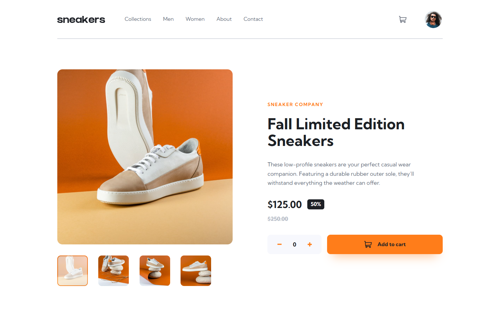
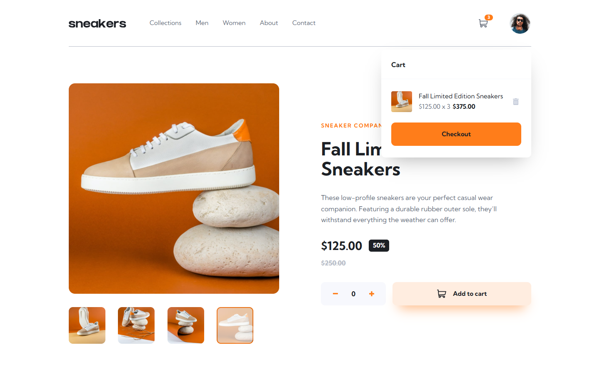
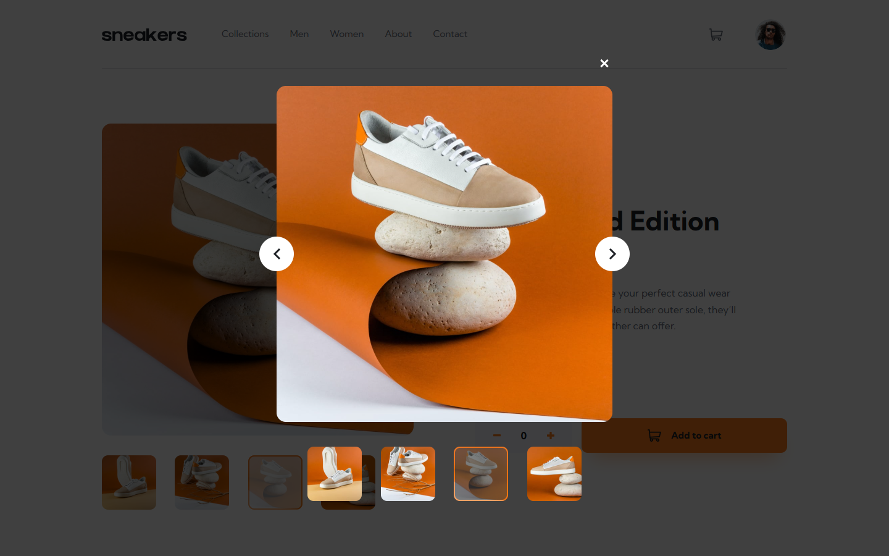
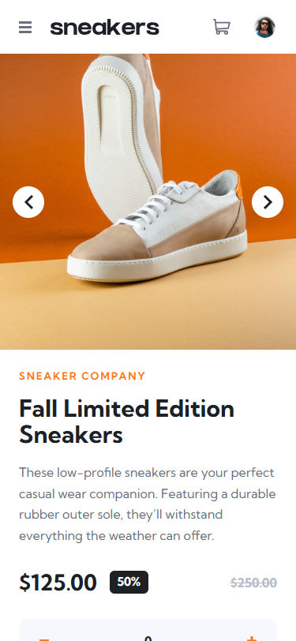

# Frontend Mentor - E-commerce product page solution

This is a solution to the [E-commerce product page challenge on Frontend Mentor](https://www.frontendmentor.io/challenges/ecommerce-product-page-UPsZ9MJp6). Frontend Mentor challenges help you improve your coding skills by building realistic projects.

## Table of contents

- [Overview](#overview)
  - [The challenge](#the-challenge)
  - [Screenshot](#screenshot)
  - [Links](#links)
- [My process](#my-process)
  - [Built with](#built-with)
  - [What I learned](#what-i-learned)
  - [Useful resources](#useful-resources)
  - [AI Collaboration](#ai-collaboration)
- [Author](#author)
- [Acknowledgments](#acknowledgments)

## Overview

### The challenge

Users should be able to:

- View the optimal layout for the site depending on their device's screen size
- See hover states for all interactive elements on the page
- Open a lightbox gallery by clicking on the large product image
- Switch the large product image by clicking on the small thumbnail images
- Add items to the cart
- View the cart and remove items from it

### Screenshot

**Desktop**



**Cart filled**



**Lightbox gallery**



**Mobile**



### Links

- Solution URL: [github.com/thatarjunaprasad-star/nilu-bhai-shoes](https://github.com/thatarjunaprasad-star/nilu-bhai-shoes)
- Live Site URL: [thatarjunaprasad-star.github.io/nilu-bhai-shoes](https://thatarjunaprasad-star.github.io/nilu-bhai-shoes)

## My process

### Built with

- Semantic HTML5 markup (`header`/`nav`/`main`/`section`, `role="dialog"`, ARIA labels and live regions)
- CSS custom properties for the style-guide design tokens
- Flexbox and CSS Grid
- Vanilla JavaScript (no frameworks) - a single state object drives the gallery, lightbox, quantity stepper and cart
- Mobile breakpoint at 56.25rem with a hamburger menu and swipe-style image arrows
- `prefers-reduced-motion` support
- Playwright test suite (27 automated checks + screenshots) run against the system Chrome

### What I learned

The two bugs that taught me the most:

1. **The `[hidden]` attribute loses to author CSS.** My lightbox used `display: grid` in the stylesheet, which silently overrides the UA's `[hidden] { display: none }` - so the "closed" lightbox backdrop still covered the page and swallowed every click. One line fixed it:

```css
[hidden] { display: none !important; }
```

2. **Absolute-positioned dropdowns vs. mobile scroll position.** On mobile the cart dropdown sits under a non-sticky header, so opening it while scrolled down left it off-screen. Scrolling to top when the cart opens keeps it visible:

```js
if (willOpen && window.scrollY > 0) window.scrollTo({ top: 0, behavior: "smooth" });
```

I also kept the initial page weight at ~174KB (of ~370KB total imagery) by lazy-loading the thumbnails, preconnecting to Google Fonts and giving every image explicit dimensions to prevent layout shift.

### Useful resources

- [The Markdown Guide](https://www.markdownguide.org) - for writing this README
- [Frontend Mentor style guides](https://www.frontendmentor.io) - the provided `style-guide.md` tokens made the colour/spacing decisions for me

### AI Collaboration

I built this with Qoder, an AI coding agent:

- **Design extraction** - Qoder read the challenge JPGs and `style-guide.md`, then proposed the semantic HTML structure and CSS custom-property tokens.
- **Implementation** - the gallery/lightbox/cart interactions were written as vanilla JS with a single state object, then refined together.
- **Testing** - Qoder wrote a 27-check Playwright suite (thumbnail switching, lightbox keyboard handling, cart maths, mobile menu, overflow checks) and captured the screenshots above as evidence against the design states.
- **Deployment** - repo creation, the Git push and GitHub Pages setup were all done through the agent as well.

What worked well: iterative screenshot comparison caught real visual regressions, not just console errors. What was harder: getting the lightbox and cart positioning right on mobile needed two genuine bug-fix passes, not just eyeballing.

## Author

- GitHub - [@thatarjunaprasad-star](https://github.com/thatarjunaprasad-star)
- Frontend Mentor - [@thatarjunaprasad-star](https://www.frontendmentor.io/profile/thatarjunaprasad-star)

## Acknowledgments

Thanks to my teammates Asad, Hani, Razzak, Manik and Sabby for the workflow pressure-testing, and to Pricila, Ridi, Neropama, Priya and Puja for the design feedback. Built as the "Nilu Bhai Shoes" product page.
